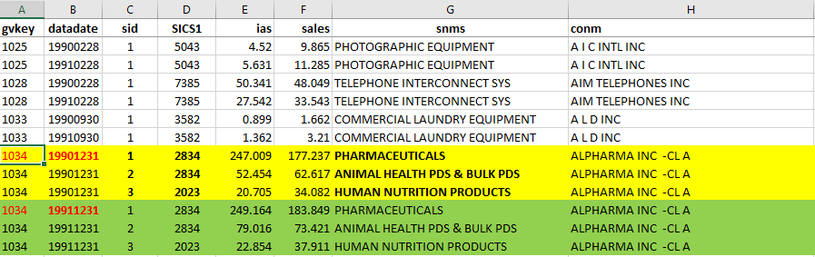
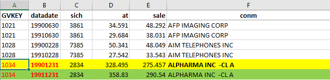
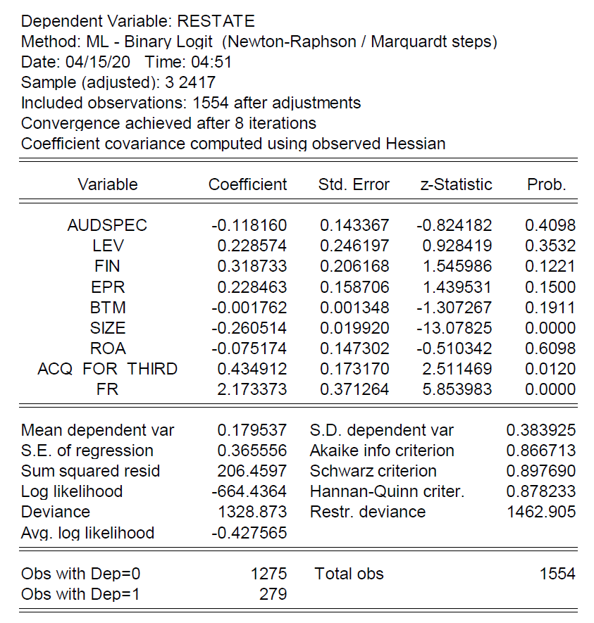
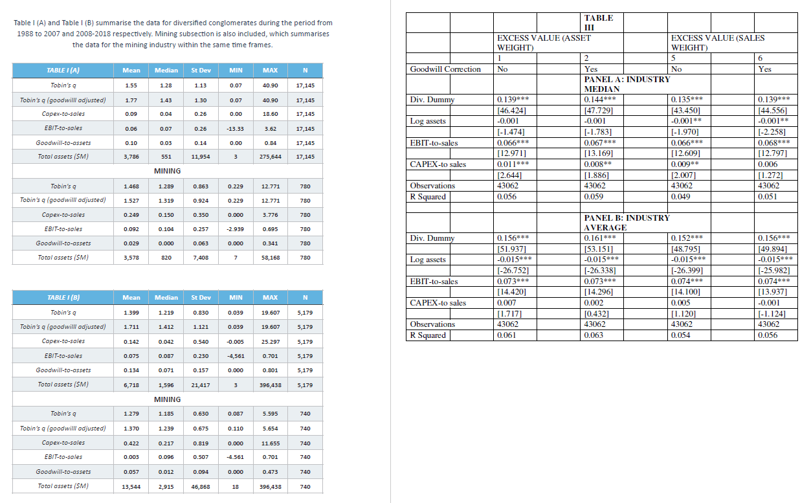

## This theme group concerns

- Discount on diversified firms' valuations, when benchmarked against focused firms' (Berger and Ofek 1995)
- The literature usually defines
  - diversified firms = multiple-segment (MS) firms
  - focused firms = single-segment (SS) firms

## Comparison metric  

- Berger and Ofek (1995) use various asset/sales/EBIT multiples, incl.
  - the q ratio used in Custodio (2014)
    - q = Market Value to Book Value of total assets
- BV of TA is measured with Compustat's variable `at`
  - MV of TA is estimated with
    - `at - ceq + prcc_f*csho`,
  - where
    - `ceq` = BV of common equity
    - `prcc_f` = closing share price at fiscal year end
    - `csho` = number of common shares outstanding

## The comparision benchmark

- For any MS firm, 
  - find an equivalent 'synthetic' MS firm
- Compare the MS firm's q actually observed (q_Obs) to the q imputed (q_Imp) for the synthetic MS firm 
  - a **valuation discount** if q_Obs/q_Imp < 1, i.e., 
    - **Excess value xv** = log(q_Obs/q_Imp) **< 0**
  
  

## Imputed q ratio  

- Suppose the MS firm in concern has two segments 
  - Segment A in the SIC = 4237 industry
  - Segment A in the SIC = 2815 industry
    - the full 4-digit SIC code is the Standard Industry Classfication code
    
- To construct the synthetic MS firm as the comparison benchmark,
  - select a typical SS firm from the SIC = 4237 industry
  - select a typical SS firm from the SIC = 2815 industry
  - a firm formed with these SS firms as though they were its segments is the synthetic firm

- By 'typical', it means the median (or the average) in Custodio (2014)  
  
  
  
## Different operation scale?  

- The SS firms in general have operation scales different from the segments' of the MS firm.
- No worries. The q ratio is scale-free!
  - simply use the actually observed q ratios of the SS firms as the q ratios imputed for the segments of the MS firm
  - weight these q ratios (e.g.,  by the segment assets of the MS firm) to compute a weighted average q ratio as the imputed q ratio (q_Imp) for the MS firm
  

## Example segment-level and firm-level data

{.class width=80%}

# Elements of Research 

- **Data**
- Research questions / Objectives
- Literature search
  - identify key prior studies to build upon (e.g., Berger and Ofek 1995, Campa and Kedia 2002)
- Analysis techniques (e.g., statistical models and tests)
  - borrow techniques from prior studies, mix and match, etc
+ Implementation tool (e.g., R, Stata) 
+ Writing the project report 

# Typical sections of project report

- Abstract
- Introduction
- Literature Review
- Research Methodology
- Analysis and Results
- Conclusions

# Abstract

- A very brief summary of your research 
  - highlighting the most essential elements, findings, and/or takeaways
  - often around 250 words, up to about half of the first page of the report
  

## Introduction

- describe the _*objectives*_ of your research, e.g., 
  - to answer a research question that has not yet been fully addressed 
  - to compare the findings of different analysis approaches and assess their relative usefulness
- motivate the objectives, i.e., explain why they are _*interesting and important*_
  - not just to you but to most other people (or particular important parties, e.g., investors, regulators, etc)
- give a quick _*'executive summary'*_ of the research, incl.
  - key results
  - your contributions (i.e., what you incrementally add to the world and why it is worth knowing your addition)

## Literature Review

  - give an overview of the related literature, especially those most closely related to your research (e.g., borrowed the analysis techniques)
  - explain how the reviewed studies are related to your research, or how they are related to each other in the literature
  

  
## Research Methodology

  - describe the sample construction, the analysis methods, and how they fit with each other
  - explain why this methodology can serve the project objectives (e.g., answer your research questions)
  
  - how large should the sample be?
      - the larger it is, the stronger your evidence is, the more general your conclusions are 
      - thus, _*as large as it could feasibly be*_ (without breaking your pc, making it too slow, etc)
        - (or limted by RStudio Cloud's resources, e.g., only 1 GB memory for the free tier)

  
## Analysis and Results

  - report the main analysis in professionally-looking tables (and figures) 
  - make sense of the analysis results 
    - e.g., highlight certain expected results, explain why certain results are not as expected
  - report any additional analysis  (e.g., subsample analysis, robustness checks)
  

  
## Conclusions 

  - summarize the key takeaways most consistent with the evidence fom your analysis

# Data options

<!-- 
* ~~Questionnaires to collect first-handed~~ 
  - ~~often end up in a biased, small sample~~
-->  
- Commercial databases subscribed by Cass
  - a range of choices on [WRDS] (but only those with [subscriptions])
  - important to understand the meaning of the data variables and the structure of the databases
    - e.g., [`sale`] (consolidated firm-level sales) vs. [`sales`] (segment-level sales)
<!--     - e.g., [`ib`] vs. [`ibcom`]  -->
    - search Compustat's variable definitions [here]

[WRDS]: https://wrds-www.wharton.upenn.edu/pages/dart-pathways/
[subscriptions]: https://wrds-www.wharton.upenn.edu/users/products/
[`ib`]: https://wrds-web.wharton.upenn.edu/wrds/support/Data/_001Manuals%20and%20Overviews/_001Compustat/_001North%20America%20-%20Global%20-%20Bank/_000dataguide/ib.cfm
[`ibcom`]: https://wrds-web.wharton.upenn.edu/wrds/support/Data/_001Manuals%20and%20Overviews/_001Compustat/_001North%20America%20-%20Global%20-%20Bank/_000dataguide/ibcom.cfm
[`sale`]: https://wrds-web.wharton.upenn.edu/wrds/support/Data/_001Manuals%20and%20Overviews/_001Compustat/_001North%20America%20-%20Global%20-%20Bank/_000dataguide/sale.cfm 
[`sales`]: https://wrds-web.wharton.upenn.edu/wrds/support/Data/_001Manuals%20and%20Overviews/_001Compustat/_001North%20America%20-%20Global%20-%20Bank/_000dataguide/sales.cfm  
[here]: https://wrds-web.wharton.upenn.edu/wrds/support/Data/_001Manuals%20and%20Overviews/_001Compustat/_001North%20America%20-%20Global%20-%20Bank/_000dataguide/index.cfm

# Your contribution to the world

- baseline: replicate the diversification discount finding using more recent data
- additionally, in any of the following directions
  - consider new explanatory variables
  - use alternative methodologies
  - deepen the understanding for certain interesting scenarios
    - how about for a particular industry?
    - how about for a particular sample period/year?
    - what else?
  - in any case, need to justify your choice convincingly!
- any insight to practitioners?  

## New explanatory variables

- What explanations/variables have been looked at?
  - e.g., see all the [papers citing] Berger and Ofek (1995)
    - in particular, Martin and Sayrak (2003), Wan et al (2011), and Ahuja and Novelli (2017) in the [shared folder]
  - also, can the review paper on business groups by [Colli and Colpan (2014)] inspire anything related?
- What new explanations/variables can you propose?
  - Can you find quantifiable measures for the new explanations?
- How about using more recent data to re-examine old explanations with mixed findings (so not hopeless)?

[papers citing]: https://apps.webofknowledge.com/summary.do?product=WOS&parentProduct=WOS&search_mode=CitingArticles&qid=8&SID=E4QoXwdAjzNYbVmIYwl&&page=1&action=changePageSize&pageSize=50
[shared folder]: https://cityuni-my.sharepoint.com/:f:/g/personal/andrew_yim_1_city_ac_uk/ElW_50Lo-p1Bsjivo6HMgEYBToyBy6KTJ9dD-gWPT5h--g?e=apiFK9
[Colli and Colpan (2014)]: https://cityuni-my.sharepoint.com/:b:/r/personal/andrew_yim_1_city_ac_uk/Documents/!%20Dissertations/FYP/Related%20studies%20(Diversification%20Discount)/Colli%20and%20Colpan-Business%20Groups%20and%20Corporate%20Governance-%20Review,%20Synthesis,%20and%20Extension_2014CGIR.pdf?csf=1&web=1&e=qd6yBp

## Alternative methodologies

- For example, 
  - Custodio (2014) uses q ratio; Berger and Ofek (1995) use various asset/sales/EBIT multiples, etc
    - Are there other relevant metrics that have not been considered before?
    - explain why a proposed metric has an edge over previously used metrics!
  - Any other equally reasonable imputed q ratio to use besides the industry median (or mean) based on all single-segment firms of the industry?
    - How about confining to SS firms matched by certain firm characteristics? 
      - (e.g., using the propensity score matching or other matching methodologies)
    

# Barriers to success

- Bad time management
  - **too much time on trying to find the best objectives** 
  - <fragment>too little on actually working out the analysis </fragment>
- Unrealistic / naive planning
  - wishfully plan to **spend only an afternoon to collect the data** for analysis
- **No justification to choices** made in the research process
  - significant results can't be guaranteed but how to make choices is fully controllable
- Insufficient attention to details
  - **all kinds of inconsistency** in the research process and the project report
  - eg,  research cited in the main text not included in reference list
    - [Zotero] can help you prevent such inconsistency (see videos: [get-started], [insert-citations]; MS Word [plugin])

[Zotero]: https://www.zotero.org/
[get-started]: https://youtu.be/H8UTehdF92s
[insert-citations]: https://youtu.be/v4zujRE98c8
[plugin]: https://www.zotero.org/support/word_processor_plugin_usage

# Expectations

- very, very occasionally, there were reports in low to mid 80's 

- most reports fall in the **40's to low 70's** mark range
  - see a report in the shared folder that earned below 40

## Help me to give higher marks

- I always want to get higher marks 
  - but I need to let the **internal second marker** and the **external examiner** know the rationales for giving the marks
- For example, 
  - I had given a low 80's to a student but the second marker independently gave a lower mark, leaving the final mark to be a high 70's
  - The external examiner had questioned a case where I gave a low 40's and believed it should be a fail.
  

## Other things being equal, 

- **Which** of the reported tables below **deserve higher marks?**

## Cut-and-pasted software output
### (with distracting unnecessary details)

{.class width=45%}

## Originally prepared tables
### (with three decimal places)

{.class width=85%}

## What can lead to low marks?

- For example, 
  - a report from a theme group on accounting restatements 
    - repeatedly misspelt 'restatement' as 're**in**statement'.
    - had a literature review that discusses **not a single article** with 'restatement' in the title; 
  - The quality of the report was in line with the student's low participation in the module: 
    - Never attended any of the 5 meetings, **not even the first one**
    - Submitted a very brief project proposal. I cautioned the student: 
      - "Many details need to be filled in before one can tell if the project is likely to be workable. Please do not underestimate the effort required to complete the project and the risks involved if it is **not taken seriously enough**."
    - Never submitted the milestone Methodology chapter; **no response** to submission reminders. 

## Time to spend on the project

- no less than what you'd spend on an _*equivalent taught module*_ (full-year/one-term)
- actually, should be more 
  - because of the _*independent-learning*_ nature of the FYP/ARP
  - and the fact that you are an _*inexperienced*_ student researcher

## Prior studies in the shared folder

- Must you read them all?
  - Short answer: No
  - Long answer: 
    - The materials are there to help a student get started.
    - One may even go beyond those materials, depending on your _*aspiration and opportunity cost*_
    - So everyone should make their own judgment
    
- In any circumstances, at least be very familiar with the details in 
  - Berger and Ofek (1995) and Campa and Kedia (2002)

# Demo codes in R

- The codes were originally created to replicate some diversification discount results in Table III of Custodio (2014)

- simple changes to the codes should already let you create, for a different sample period, the excess value variables for measuring the divesification discount (in terms of q ratios) 

- if you prefer Stata instead, 
  - the demo codes show you the flows with which you can base on to code in Stata
    - (though I don't use Stata and am not sure how Stata can accomplish the same tasks)

# Base R and R packages

- Base R refers to the capability of R before loading any additional packages
- The demo codes use the following packages
  - {magrittr} allows piping together different operations into one sequence, like the different steps of a factory production line
  - {tidyverse} provides functions to work on a dataframe (i.e., like a worksheet), such as
    - filter(), select(), mutate(), left_join(), group_by(), etc
  - {lubridate} provides functions to work on date-type variables, such as
    - ymd(), year(), month(), day()
  - {stargazer} allows the results of multiple regression models to be presented in a single table neatly

